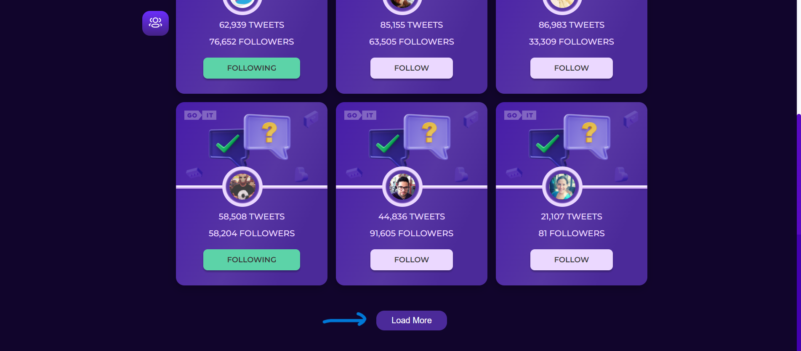

# Tweets Social App

[Open Link](https://dianaforost.github.io/goit-test-task/)
## Description
Application "Tweets Social App" is created for easy communication with other people. Here you can subscribe, unsubscribe, view all users and filter users to whom you are subscribed and to whom you are not.

## Devices
You can open it on a phone, tablet or laptop
## How to use
Click on the button in the additional menu (menu on the right) or on the "Go to tweets" button and you will see all users.

By clicking on the "Filter tweets" button, you can filter all tweets by who you are following and who you are not yet following.
By clicking on the "Back" button, you can return to the Home page

By clicking "Previous" you will see the previous ones. And by clicking on the "Newt" button, you can see the following users.
